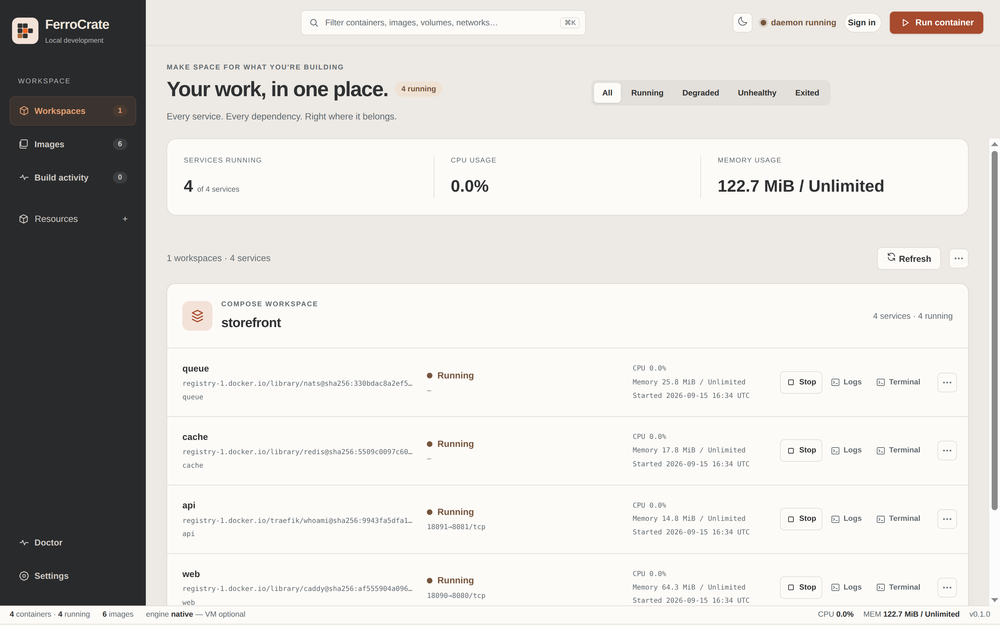
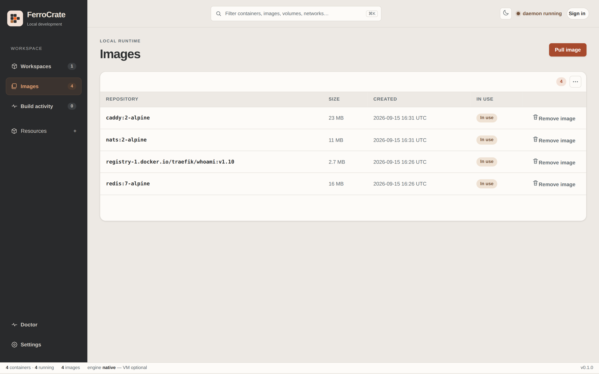

<p align="center">
  
</p>

<p align="center">
  
  
  
</p>

Ferrocrate runs containers the way Docker does, from a single Rust binary.
Point your existing `docker` CLI, Dockerfiles, and Compose files at it and
they work unchanged; or use the native `ferro-cli` command, the desktop app,
or the fleet control plane. On Linux a container is a normal process the
kernel isolates, and that is where the speed comes from. Every capability the
project claims is backed by a dated test report you can read.

**Status: alpha release.** Production qualification is in progress on the
[roadmap](docs/ROADMAP.md).
Historical host and desktop test reports describe their dated scope; they do
not qualify the current candidate. See the
[candidate support contract](docs/operations/candidate-support-2026-09-05.md)
for required host, runtime, installer and UI evidence. All CI and release jobs
use self-hosted runners only.

<p align="center">
  
</p>

## Install

Download a package from the [latest release](https://github.com/dgdev25/ferrocrate/releases/tag/v0.1.0-unsigned),
then follow the platform guide. These are local, unsigned builds: not
notarized, not code-signed, and the in-app updater is disabled until a
signed release ships.

| Platform | Package | Download | Guide |
| --- | --- | --- | --- |
| macOS 13+ (Intel) | `FerroCrate_Desktop_0.1.0_x64.dmg` | [.dmg](https://github.com/dgdev25/ferrocrate/releases/download/v0.1.0-unsigned/FerroCrate_Desktop_0.1.0_x64.dmg) | [Install on macOS](#install-on-macos) |
| Linux (x86_64, glibc) | `FerroCrate.Desktop_0.1.0_amd64.deb` or `.AppImage` | [.deb](https://github.com/dgdev25/ferrocrate/releases/download/v0.1.0-unsigned/FerroCrate.Desktop_0.1.0_amd64.deb) &#124; [.AppImage](https://github.com/dgdev25/ferrocrate/releases/download/v0.1.0-unsigned/FerroCrate.Desktop_0.1.0_amd64.AppImage) | [Install on Linux](#install-on-linux) |
| Windows 10/11 (x64) | `FerroCrate.Desktop_0.1.0_x64-setup.exe` or `.msi` | [.exe](https://github.com/dgdev25/ferrocrate/releases/download/v0.1.0-unsigned/FerroCrate.Desktop_0.1.0_x64-setup.exe) &#124; [.msi](https://github.com/dgdev25/ferrocrate/releases/download/v0.1.0-unsigned/FerroCrate.Desktop_0.1.0_x64_en-US.msi) | [Install on Windows](#install-on-windows) |

### Install on macOS

Open the `.dmg`, drag **FerroCrate Desktop** to Applications. Gatekeeper
blocks an unsigned app on the first launch: right-click the app in
Applications and choose **Open**, then confirm. Later launches open normally.

### Install on Linux

**Debian/Ubuntu:** `sudo apt install ./FerroCrate.Desktop_0.1.0_amd64.deb`

**Any distro (glibc-based):** make the AppImage executable and run it —
`chmod +x FerroCrate.Desktop_0.1.0_amd64.AppImage && ./FerroCrate.Desktop_0.1.0_amd64.AppImage`

### Install on Windows

Run the installer. Since it isn't signed, SmartScreen will show "Windows
protected your PC" — click **More info**, then **Run anyway**.

## Desktop app

The desktop app shows Compose projects as workspaces, with per-service status,
ports, CPU and memory, and one-click logs, terminal and stop. Start it from a
checkout with `scripts/dev-desktop.sh` (add `--web` to open it in a browser).

<picture>
  <source media="(prefers-color-scheme: dark)" srcset="docs/assets/screenshots/workspaces-dark.png">
  
</picture>

<picture>
  <source media="(prefers-color-scheme: dark)" srcset="docs/assets/screenshots/images-dark.png">
  
</picture>

## Getting started

Every command below was run as a normal user, without `sudo`, on the Linux
host that builds this repository. The native CLI needs no daemon: each command
does its own work and keeps images, containers and volumes under
`~/.ferrocrate` (`/var/lib/ferrocrate` when run as root; set `FERROCRATE_HOME`
to use another directory). If you know Docker, the commands and flags are the
same; only the binary name differs.

### What you need

- A Linux host from the [platform support](#platform-support) table. macOS and
  Windows users get the desktop app, not the CLI.
- Rust through `rustup`. The repository pins the toolchain in
  `rust-toolchain.toml`, so `rustup` installs the right version on first build.
- For rootless use: unprivileged user namespaces enabled, entries for your
  user in `/etc/subuid` and `/etc/subgid`, and the `newuidmap`, `newgidmap`,
  `slirp4netns` and `bwrap` binaries. `bash scripts/verify-rootless.sh` tells
  you what is missing.
- The `docker` CLI, only if you want step 6.

There are no prebuilt binaries yet; you build from source.

### 1. Build the CLI

```bash
git clone https://github.com/dgdev25/ferrocrate.git
cd ferrocrate
cargo build --release -p ferro-cli
install -m 755 target/release/ferro-cli ~/.local/bin/ferro-cli   # optional, puts it on PATH
```

### 2. Run a container

```bash
ferro-cli run --rm alpine:3.20 echo hello
```

This pulls the image, verifies every layer digest, runs the command and
removes the container. The first two output lines are the container id and
the runtime details; your command's output follows.

### 3. Build an image from a Dockerfile

```bash
mkdir hello && cd hello
cat > Dockerfile <<'EOF'
FROM alpine:3.20
COPY hello.sh /hello.sh
CMD ["/bin/sh", "/hello.sh"]
EOF
printf '#!/bin/sh\necho "hello from ferrocrate"\n' > hello.sh

ferro-cli build -t hello:1.0 .
ferro-cli images
ferro-cli run --rm hello:1.0
```

`build` also accepts `--build-arg`, `--secret`, `--cache-from` and
`--cache-to`, as Docker does.

### 4. Run a service with a name, a port and a volume

```bash
ferro-cli run -d --name web -p 8080:8080 -v webdata:/www busybox:1.36 \
  sh -c 'echo hello > /www/index.html; exec httpd -f -v -p 8080 -h /www'

curl http://127.0.0.1:8080/        # hello
ferro-cli ps                       # running containers; -a includes stopped ones
ferro-cli logs --tail 5 web        # -f follows
ferro-cli exec web ls /www         # run a command inside; -it for a shell
ferro-cli stop web
ferro-cli start web
ferro-cli stop web
ferro-cli rm web
ferro-cli volume rm webdata
```

### 5. Compose

```bash
cat > compose.yaml <<'EOF'
services:
  app:
    image: alpine:3.20
    command: ["sh", "-c", "echo compose says hi; sleep 3600"]
EOF

ferro-cli compose up -d
ferro-cli compose ps
ferro-cli compose logs
ferro-cli compose down
```

`compose` also has `stop`, `start`, `restart`, `pull`, `config` and `watch`.

### 6. Keep using the real Docker CLI

Start the daemon with the Docker-compatible API on, then point `DOCKER_HOST`
at its socket. The daemon shares the same state directory as the native CLI,
so images built one way are visible the other way.

```bash
# rootless
ferro-cli daemon --docker-compat --socket "$XDG_RUNTIME_DIR/ferrocrate.sock" &
export DOCKER_HOST="unix://$XDG_RUNTIME_DIR/ferrocrate.sock"

# or as root (default socket /var/run/ferrocrate.sock)
sudo ferro-cli daemon --docker-compat &
export DOCKER_HOST=unix:///var/run/ferrocrate.sock

docker version
docker build -t hello:1.0 .
docker run --rm hello:1.0
docker ps -a
```

Docker's default BuildKit path works through this socket; see
[How it works](#how-it-works) for the limits.

### 7. Clean up

```bash
kill %1                        # stop the daemon from step 6 (as root: sudo pkill -x ferro-cli)
ferro-cli rmi hello:1.0
ferro-cli system prune         # stopped containers, unused images, build cache
ferro-cli volume prune
```

Optional: `ferro-cli dashboard --listen 127.0.0.1:43190` serves a local
browser dashboard for the life of the command and prints a one-time token URL.

## How it works

<picture>
  <source media="(prefers-color-scheme: dark)" srcset="docs/assets/how-it-works-dark.svg">
  
</picture>

Your command, from `docker` or the native CLI, reaches the daemon on a
Docker-compatible API socket (the same protocol Docker speaks, so existing
tools do not know the difference). The runtime unpacks the image layers,
isolates the process with Linux namespaces and cgroups (the kernel features
that give a process its own view of the filesystem, network, and resource
limits), wires its network, and starts it. There is no virtual machine on
Linux and no second daemon: one binary does the work.

Builds go through the same daemon. Docker's default BuildKit path is
supported through the authenticated Buildx docker driver; the classic build
path is kept and produces the same image digest. Arbitrary LLB and
`gateway.v0` frontends are not supported.

## Benchmarks against Docker

<p align="center">
  
</p>

All numbers below are medians from paired runs on the same host, with both
engines unprivileged and the same image. Negative means Ferrocrate is faster.
Every row links the report it comes from; nothing here is estimated.

### Paired harness, 2026-08-23

Host: Intel i9-14900K, 32 threads, 61 GB RAM, Ubuntu 26.04, kernel 7.0.0-30,
Docker 29.7.2. `alpine:latest`, `--network none`, 10 iterations (5 for pull
and build). Report: [`docs/evidence/performance/2026-08-23-docker-vs-ferrocrate.md`](docs/evidence/performance/2026-08-23-docker-vs-ferrocrate.md).

| Operation | Ferrocrate | Docker | Difference |
|---|---:|---:|---:|
| Start container (detached) | 0.008 s | 0.114 s | −93% |
| Stop container (`-t 1`) | 0.032 s | 1.115 s | −97% |
| Exec a command | 0.016 s | 0.064 s | −75% |
| Read 1,000 log lines | 0.007 s | 0.016 s | −52% |
| List containers (`ps -a`) | 0.007 s | 0.032 s | −76% |
| List images | 0.008 s | 0.114 s | −93% |
| Create a volume | 0.008 s | 0.016 s | −52% |
| Build, no cache (COPY-only Dockerfile) | 0.008 s | 0.264 s | −97% |
| Build, cached (COPY-only Dockerfile) | 0.007 s | 0.765 s | −99% |
| **Run to exit (attached)** | **0.364 s** | **0.164 s** | **+122% (Docker faster)** |
| Cold pull (baseline run only) | 1.474 s | 3.183 s | −54% |

Notes from the report: Docker's `stop` time is dominated by its polling of
the grace period. Build rows compare only COPY-only Dockerfiles because
rootless `RUN` steps failed on that host's kernel 7.0 at the time. The cold
pull row comes from the baseline run; the verdict rerun could not prove a cold
Docker pull on a shared daemon and records `n/a`.

### Attached run-to-exit, after the fix

The attached-run loss above was traced to Ferrocrate's attach ordering and
fixed. The paired re-measurement on the qualification host, 20 alternating
rounds with a `FROM scratch` BusyBox image
([`2026-08-24-attached-run-to-exit.md`](docs/evidence/performance/2026-08-24-attached-run-to-exit.md)):

| Operation | Ferrocrate | Docker | Difference |
|---|---:|---:|---:|
| Run to exit (attached), before the fix | 0.276 s | 0.177 s | +56% (Docker faster) |
| Run to exit (attached), after the fix | 0.033 s | 0.169 s | −80% |

### Release gate: ten fixed operations, both network backends

This is the set the release gate checks on every candidate: 3 rounds,
medians, same `alpine:3.20` digest, run once with the iptables backend and
once with nftables. Host: Ubuntu 26.04, kernel 7.0.0-30, Docker 29.7.2,
head `4e515d87`, 2026-08-21. Reports:
[iptables](docs/evidence/performance/2026-08-21-docker-comparison-current-head-4e515d87-iptables.md),
[nftables](docs/evidence/performance/2026-08-21-docker-comparison-current-head-4e515d87-nftables.md);
register: [`benchmark-register.md`](docs/evidence/performance/benchmark-register.md).

| Operation | Ferrocrate (iptables / nftables) | Docker (iptables / nftables) | Difference |
|---|---:|---:|---:|
| Warm image pull | 1507 / 1507 ms | 1608 / 1608 ms | −6% |
| Run to exit, no network | 105 / 106 ms | 207 / 206 ms | −49% |
| Dockerfile build (cached base) | 106 / 106 ms | 306 / 306 ms | −65% |
| Network create + remove | 106 / 106 ms | 306 / 206 ms | −65% / −49% |
| Volume create + remove | 106 / 106 ms | 105 / 106 ms | +1% / tie |
| List images | 106 / 106 ms | 106 / 107 ms | tie |
| List networks | 106 / 106 ms | 106 / 107 ms | tie |
| API `/_ping` | 106 / 107 ms | 106 / 107 ms | tie |
| API `/version` | 106 / 106 ms | 106 / 106 ms | tie |
| API `/info` | 106 / 107 ms | 106 / 106 ms | tie / +1% |

The many ~106 ms results are the harness floor (process start plus a fixed
sampling interval), not a measurement of the engines; the gate exists to
catch regressions, not to rank the two.

### Other paired measurements

Same host family (Ubuntu 26.04, kernel 7.0.0-2x/30, Docker 29.7.2), 2 or 3
rounds, medians, from `docs/evidence/performance/`.

| Measurement | Ferrocrate | Docker | Difference | Report |
|---|---:|---:|---:|---|
| Cold image pull (`alpine:3.19`, caches pruned each round) | 2105 ms | 3198 ms | −34% | [2026-08-19](docs/evidence/performance/2026-08-19-docker-cold-pull-current-head-1c5b2eef.md) |
| Uncached pull throughput (`busybox:1.36`) | 1.06 MiB/s | 0.70 MiB/s | +51% throughput | [2026-08-18](docs/evidence/performance/2026-08-18-uncached-pull-3round-docker-comparison-current-head-a973e216.md) |
| Named volume create, write, read, remove | 208 ms | 308 ms | −32% | [2026-08-21](docs/evidence/performance/2026-08-21-docker-volume-io-current-head-ce6c6261.md) |
| Repeated cached build | 107 ms | 307 ms | −65% | [2026-08-21](docs/evidence/performance/2026-08-21-docker-build-cache-current-head-279a2d5d.md) |
| **Two builds in parallel** | **508 ms** | **309 ms** | **+64% (Docker faster)** | [2026-08-21](docs/evidence/performance/2026-08-21-docker-build-cache-current-head-279a2d5d.md) |
| IPv6 network create, inspect, remove | 318 ms | 519 ms | −39% | [2026-08-21](docs/evidence/performance/2026-08-21-docker-ipv6-current-head-3a24c638.md) |
| Outbound HTTP request from a container | 108 ms | 307 ms | −65% | [2026-08-21](docs/evidence/performance/2026-08-21-docker-outbound-http-current-head-e1f2b212.md) |
| **Run to exit with bridge networking** | **406 ms** | **307 ms** | **+32% (Docker faster)** | [2026-08-21](docs/evidence/performance/2026-08-21-docker-network-run-comparison.md) |
| Warm run to exit, CLI to CLI, after optimization | 139 ms | 283 ms | −51% | [2026-08-22](docs/evidence/performance/2026-08-22-optimization-pass.md) |
| `FROM scratch` + one `COPY` build | 14 ms | 532 ms | −97% | [2026-08-21](docs/evidence/performance/2026-08-21-benchmark-refresh.md) |
| 8 loopback HTTP connections (rootless) | 209 ms | 309 ms | −32% | [2026-08-22](docs/evidence/performance/2026-08-22-network-memory-parallel-verification.md) |
| 8 resolver lookups inside a container | 205 ms | 312 ms | −34% | [2026-08-22](docs/evidence/performance/2026-08-22-network-memory-parallel-verification.md) |
| Image inspect / tag / remove | 107 ms each | 107 ms each | tie | [2026-08-21](docs/evidence/performance/2026-08-21-docker-image-lifecycle-current-head-4ba062ce.md) |
| Idle daemon resident memory | 9.8 MB | 79.8 MB (`dockerd`) | 8× smaller | [2026-08-22](docs/evidence/performance/2026-08-22-network-memory-parallel-verification.md) |

Where Docker is faster today: two builds running in parallel, and run-to-exit
with bridge networking enabled. Both are open items in the benchmark
register.

<details>
<summary>Ferrocrate-only measurements (no paired Docker number)</summary>

| Measurement | Result | Report |
|---|---:|---|
| Cold start, first run after pull (target ≤ 100 ms) | 88–91 ms | [2026-08-22](docs/evidence/performance/2026-08-22-startup-slo-refresh.md) |
| Warm start p95 (target ≤ 50 ms) | 47–49 ms | [2026-08-22](docs/evidence/performance/2026-08-22-startup-slo-refresh.md) |
| Daemon memory added per container | 0 KiB | [2026-08-22](docs/evidence/performance/2026-08-22-startup-slo-refresh.md) |
| 100 create/start/stop/remove cycles in a row | 100/100, 105 ms mean cycle | [2026-08-21](docs/evidence/performance/2026-08-21-ferrocrate-container-lifecycle-100-current-head-ce80ecd7.md) |
| Release CLI binary size | 20 MiB | [2026-08-17](docs/evidence/performance/2026-08-17-binary-size-current-head-5ae8fb45.md) |
| Compose: up + scale 3 services | 654 ms | [2026-08-25](docs/evidence/performance/2026-08-25-compose-profiles-scale-watch.md) |

</details>

Functional coverage is a separate question from speed. The 2026-08-23 report
scores Ferrocrate at 78% of Docker's local-management surface, with Docker
ahead in every coverage category; the exact rows are in the
[feature matrix](docs/FEATURE-MATRIX.md).

## Architecture

<picture>
  <source media="(prefers-color-scheme: dark)" srcset="docs/assets/architecture-dark.svg">
  
</picture>

Four kinds of client, one daemon, three subsystems, one kernel:

- **Clients:** the native CLI (`ferro-cli`), any Docker client over the
  compatible API, Compose (`ferro-compose`), and Kubernetes through the CRI
  (`ferro-cri`, the interface a kubelet uses to ask a runtime for pods).
- **Daemon:** one binary that owns state and dispatches work.
- **Container runtime** (`ferro-core`): creates and supervises containers,
  with PID-identity checks so only the caller that started a container can
  act on it.
- **Image store:** OCI layers and the build cache.
- **Networking** (`ferro-net`, `ferro-netd`): bridges, DNS, IPv6, WireGuard,
  iptables or nftables backends; eBPF port publishing is opt-in.
- **Kernel:** namespaces, cgroups, seccomp, netfilter, eBPF. Ferrocrate adds
  no layer between the container and the kernel.

Around the engine: `ferro-desktop` and the Tauri app in `apps/ferro-desktop-ui`
(desktop on Linux, WSL2 on Windows, a QEMU/HVF Linux VM on macOS), `ferro-mgr`
(fleet control plane with a certificate-bound browser UI), `ferro-web` (the
shared browser transport), and `ferro-mind` (resource monitoring and anomaly
features for containers).

## Platform support

| Platform | Status |
|---|---|
| Ubuntu 26.04 / 24.04, Debian 12 / 13, Fedora 42, Alpine 3.22 (x86_64, rootful) | Supported; dated rows in the feature matrix |
| Ubuntu 24.04 on Oracle A1 (aarch64, kernel 6.17) | Supported; dated row in the feature matrix |
| Rocky 9 (kernel 5.14), Ubuntu 20.04 HWE (kernel 5.15) | Qualified with opt-in `legacy-peercred`; the default pidfd authentication fails closed on these kernels |
| Rootless mode | Qualified on the host rows in the feature matrix; a missing `SO_PEERPIDFD` fails closed unless legacy peercred is enabled |
| Windows 11 | Desktop app through WSL2; 24/24 acceptance checks ([final VM verification](docs/evidence/desktop/2026-08-25-vm-acceptance.md#final-vm-verification----2026-08-26)) |
| macOS Tahoe | Desktop app through a QEMU-HVF Linux VM; 24/24 acceptance checks ([final VM verification](docs/evidence/desktop/2026-08-25-vm-acceptance.md#final-vm-verification----2026-08-26)) |

Images are built and run only for the host's architecture. There is no
emulation of foreign architectures, no `--platform` builds, and no
multi-architecture manifests; cross-platform output is deferred under item 10
of the [roadmap](docs/ROADMAP.md).

The authoritative support contract is
[`docs/FEATURE-MATRIX.md`](docs/FEATURE-MATRIX.md). Every row links dated
evidence under [`docs/evidence/`](docs/evidence/), and where a feature is
experimental or unsupported, the matrix says so.

## Going further

- **Fleet UI:** `ferro-mgr fleet-ui` manages enrolled hosts over an
  operator-authenticated mTLS admin endpoint, with Hosts, Containers, Deploys,
  and Health screens; read-only `view` sessions and audited `operate` actions.
  Report: [fleet acceptance](docs/evidence/fleet/2026-08-25-fleet-test-report.md).
  Local demo: `scripts/fleet-demo.sh up`.
- **Dashboard:** the browser dashboard's 24 checks, token, Host and Origin
  rules are in the [dashboard report](docs/evidence/desktop/2026-08-25-dashboard-test-report.md).
- **LAN image mirror (experimental, opt-in):** announces images by mDNS and
  serves digest-verified, read-only pulls to peers on private IPv4, falling
  back to the registry. Proof: [LAN mirror evidence](docs/evidence/networking/2026-08-25-lan-image-mirror.md).
- **Packaging:** Linux deb and AppImage, macOS DMG, Windows MSI and NSIS, each
  with an install-and-smoke record under [`docs/evidence/packaging/`](docs/evidence/packaging/).
  The macOS and Windows artifacts are not code-signed.
- **Security and hosts:** `scripts/verify-apparmor-rootless-host.sh` qualifies
  the packaged Ubuntu AppArmor profile on a disposable host; see
  [`SECURITY.md`](SECURITY.md).

## Development

```bash
cargo test --workspace                       # full suite
cargo test -p ferro-core --lib               # runtime core
bash scripts/docker-client-conformance.sh    # 85-scenario docker CLI gate
```

GitHub Actions runs the build, unit, frontend, and warning gates on
self-hosted Linux, macOS, and Windows runners; scheduled canaries build the
platform bundles. Contribution and release notes:
[`CONTRIBUTING.md`](CONTRIBUTING.md), [`docs/RELEASE.md`](docs/RELEASE.md),
[`docs/operations/external-ci.md`](docs/operations/external-ci.md).
Open follow-ups live in [`docs/ROADMAP.md`](docs/ROADMAP.md).

## License

[Apache-2.0](LICENSE)
