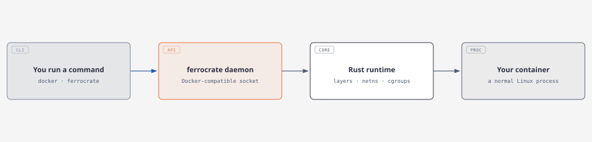
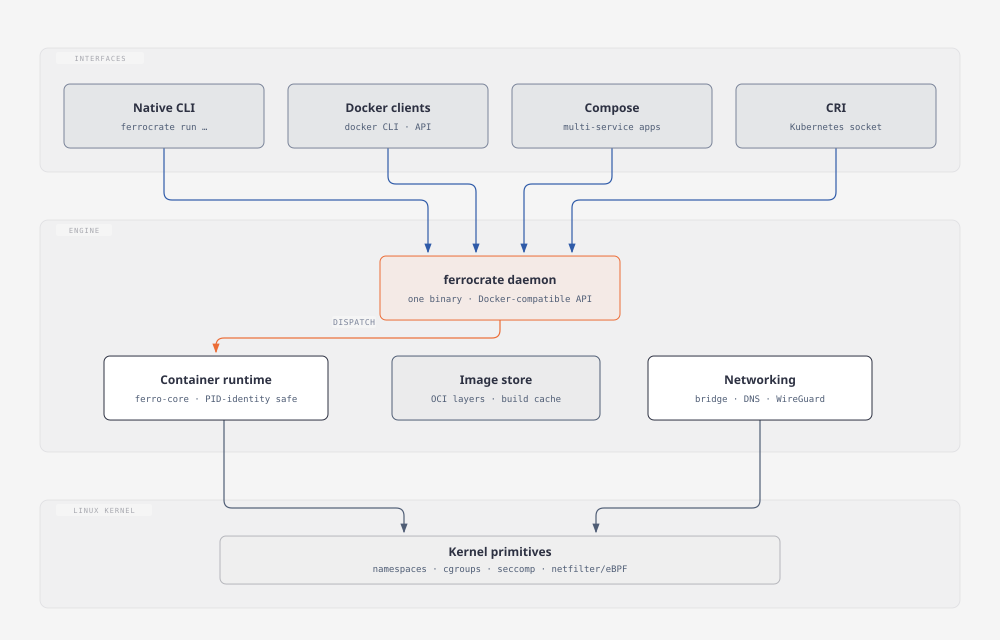

<p align="center">
  
</p>

Ferrocrate is a container engine you use exactly like Docker — same commands,
same Dockerfiles, same images — implemented from scratch in Rust as a single
binary. The genuine `docker` CLI works against its daemon unmodified: the
conformance suite drives a real Docker client through 35 scenarios on every
merge, and all 35 pass. Images are standard OCI, so anything Ferrocrate builds
runs under Docker, podman, or Kubernetes, and the other way round.

## ✨ Highlights

- **Docker-compatible, verified** — 35/35 conformance against the real
  `docker` client: lifecycle, build, exec, logs, volumes, networks, events.
- **Fast** — faster than Docker on 10 of 11 measured operations, most by
  50–97% (see the benchmark below, including the one loss).
- **One binary** — daemon, native CLI, Compose, and a Kubernetes CRI endpoint
  in a single Rust executable. No shim stack.
- **Safety engineering** — destructive operations verify process identity by
  PID start-time before signaling, so a recycled PID is never killed by
  mistake; state survives daemon restarts and is reconciled on startup.
- **Qualified, not assumed** — every support claim links dated evidence from
  real hosts: five Linux distributions, Windows/WSL2, and macOS.

## 🚀 Quickstart

```bash
cargo build --release -p ferro-cli
./target/release/ferro-cli run --rm alpine:3.20 /bin/true
```

Build a project the way you always have — a Dockerfile and one command:

```bash
./target/release/ferro-cli build -t myapp:1.0 .
./target/release/ferro-cli run myapp:1.0
```

Or point the real Docker CLI at Ferrocrate's daemon (classic build protocol;
BuildKit is on the roadmap):

```bash
export DOCKER_HOST=unix:///run/ferrocrate/docker.sock
DOCKER_BUILDKIT=0 docker build -t myapp:1.0 .
docker run myapp:1.0
```

`scripts/verify-rootless.sh` checks rootless prerequisites. Privileged
networking tests need a disposable Linux host.

## 🧭 How it works

<picture>
  <source media="(prefers-color-scheme: dark)" srcset="docs/assets/how-it-works-dark.svg">
  
</picture>

Your command — from `docker` or the native CLI — arrives at the daemon on a
Docker-compatible API socket. The runtime assembles the container from OCI
image layers, isolates it with Linux namespaces and cgroups, wires its
network, and starts it. There is no virtual machine in the path on Linux:
a container is a normal process tree the kernel isolates, which is where the
speed comes from.

## 📊 How it performs

<p align="center">
  
</p>

Ferrocrate wins 10 of the 11 measured operations. The honest loss: attached
run-to-exit (`docker run` without `-d`) takes 0.364 s to Docker's 0.164 s —
closing that gap is an open work order. Method, host details, and raw numbers:
[`docs/benchmarks/`](docs/benchmarks/DOCKER-VS-FERROCRATE-2026-08-23.md) and
the [benchmark register](docs/evidence/performance/benchmark-register.md).

## 🏗️ Architecture

<picture>
  <source media="(prefers-color-scheme: dark)" srcset="docs/assets/architecture-dark.svg">
  
</picture>

Four client surfaces converge on one daemon. Below it, `ferro-core` owns
container state and execution, the image store holds OCI layers and the build
cache, and the networking stack (`ferro-net`/`ferro-netd`) provides bridges,
DNS, IPv6, and WireGuard overlays — with iptables and nftables backends, and
opt-in eBPF port publishing. A `ferro-cri` socket serves Kubernetes. The
workspace also builds on macOS (Linux-only paths compile out) so the code
can be developed and unit-tested there.

## 🖥️ Platform support

| Platform | Status |
|---|---|
| Ubuntu 26.04 / 24.04, Debian 12, Fedora 42, Rocky 9 (x86_64, rootful) | Qualified with dated evidence per distro |
| Rootless mode | Qualified on Ubuntu; Rocky gated on `SO_PEERPIDFD`; Ubuntu 24.04+ needs a userns sysctl until the AppArmor profile ships |
| Windows (WSL2) | Container lifecycle and doctor verified inside WSL2 Ubuntu |
| macOS (Sonoma, Tahoe) | Builds and full test suite green — development platform, not a container host |
| Ubuntu 20.04 (HWE 5.15), Alpine/musl | Qualification in progress; stock 20.04 kernel 5.4 is below the enforced 5.10 minimum |

The authoritative support contract is
[`docs/FEATURE-MATRIX.md`](docs/FEATURE-MATRIX.md) — every claim there links
dated evidence in [`docs/evidence/`](docs/evidence/), and where a feature is
experimental or unsupported, the matrix says so explicitly.

## 🩺 Status

Ferrocrate targets Linux-first local development, not (yet) a universal Docker
replacement. Feature coverage against Docker's surface is measured at ~78%
overall — strongest in lifecycle, images, and build; thinnest in multi-network
and BuildKit, which are the current hard work orders
([`docs/remediation/ROUND-9-HARD-ITEMS.md`](docs/remediation/ROUND-9-HARD-ITEMS.md)).
AI-assisted restart/resource signals exist but are local, bounded, and off
unless enabled (`FERROCRATE_AI=0` disables everything; automatic actions
need a separate operator gate).

## 🛠️ Development

```bash
cargo test --workspace          # full suite
cargo test -p ferro-core --lib  # runtime core
bash scripts/docker-client-conformance.sh   # 35-scenario real-client gate
```

See [`CONTRIBUTING.md`](CONTRIBUTING.md), [`SECURITY.md`](SECURITY.md), and
[`docs/operations/external-ci.md`](docs/operations/external-ci.md) for the
release gates. macOS-on-VMware lab setup for cross-platform testing is
documented in [`docs/MACOS_ON_VMWARE.md`](docs/MACOS_ON_VMWARE.md).

## 📄 License

[Apache-2.0](LICENSE)
